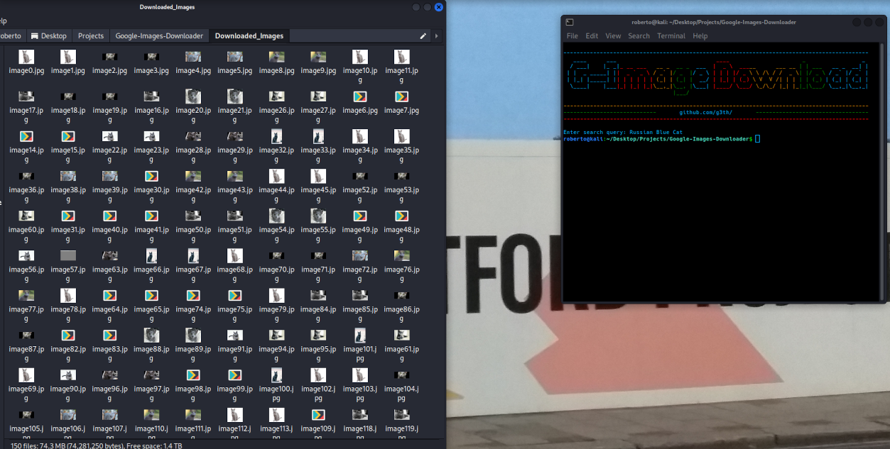

# Google-Images-Downloader



Scrapes images from a query in terminal, then downloads the images. Search anything from cats to adult search queries.

Amount of images downloaded can be set in the "pages" variable. 

The search will only return Jpegs in the current state, but everything is fully functional. If the amount of images look similar, try refining the search to a three or four word one.

Will be expanded into a more comprehensive tool in the future.

### Requirements ###

```pip3 install bs4```
